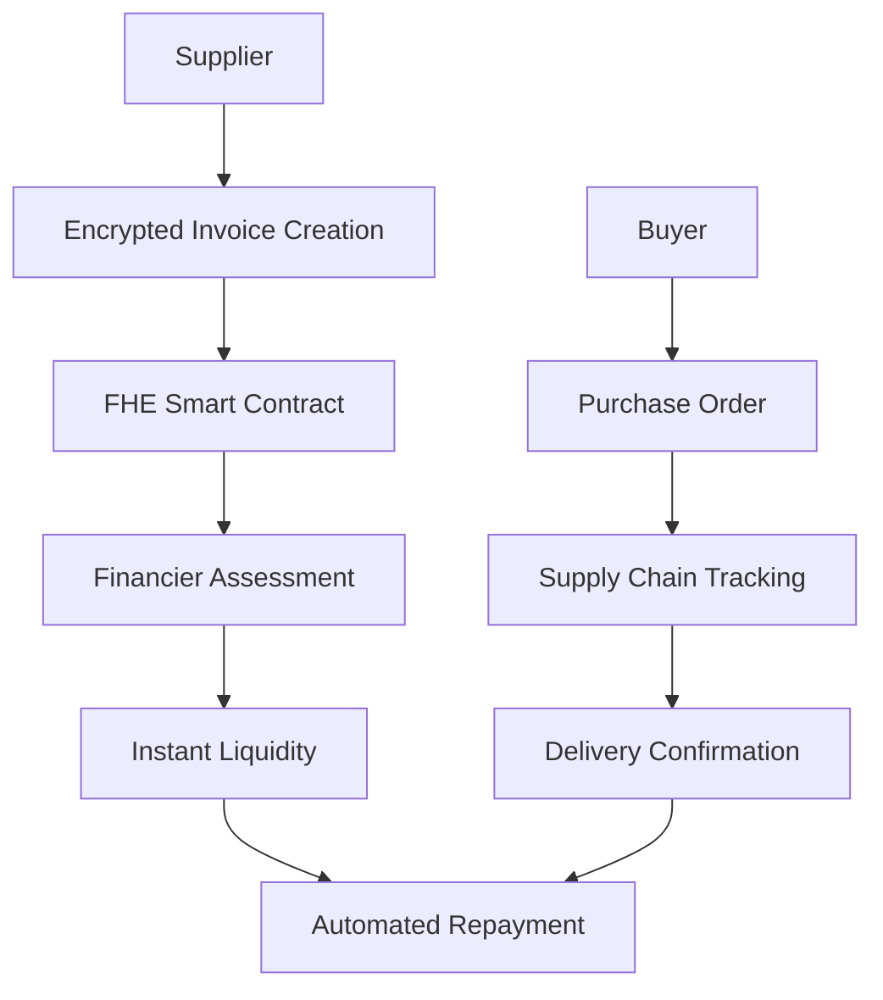

<div align="center">

# 🛡️ Encrypted Supply Chain Finance

**Privacy-First Financial Infrastructure for Global Supply Chains**

[](https://opensource.org/licenses/MIT)
[](https://www.typescriptlang.org/)
[](https://reactjs.org/)
[](https://ethereum.org/)

*Suppliers borrow against invoices with encrypted amounts, protecting competitive terms through advanced cryptographic privacy.*

</div>

---

## 🚀 What Makes Us Different

### 🔐 **End-to-End Encryption**
- **Fully Homomorphic Encryption (FHE)** protects all sensitive financial data
- Invoice amounts remain encrypted on-chain, preserving competitive advantages
- Zero-knowledge proofs ensure transaction privacy without compromising security

### ⚡ **Instant Liquidity Access**
- Real-time financing against verified supply chain flows
- Automated risk assessment using encrypted data
- 24/7 access to working capital without traditional banking delays

### 🌐 **Global Network Integration**
- Connected to major supply chain partners worldwide
- Cross-border financing with regulatory compliance
- Multi-currency support with stablecoin integration

---

## 🏗️ Architecture Overview



---

## 🛠️ Technology Stack

| Layer | Technology | Purpose |
|-------|------------|---------|
| **Frontend** | React 18 + TypeScript | Modern UI with type safety |
| **Styling** | Tailwind CSS + shadcn/ui | Responsive design system |
| **Blockchain** | Ethereum Sepolia | Testnet deployment |
| **Wallet** | RainbowKit + Wagmi | Multi-wallet connectivity |
| **Encryption** | Zama FHEVM | Fully homomorphic encryption |
| **Smart Contracts** | Solidity 0.8.24 | On-chain logic with FHE |
| **Build Tool** | Vite | Fast development & building |

---

## 🚀 Quick Start

### Prerequisites
- **Node.js** ≥ 18.0.0
- **npm** ≥ 8.0.0
- **Git** for version control

### Installation

```bash
# Clone the repository
git clone https://github.com/cryptoNomad21/cryptosupply-chain.git
cd cryptosupply-chain

# Install dependencies
npm install

# Start development server
npm run dev
```

Visit `http://localhost:5173` to see the application.

---

## ⚙️ Configuration

### Environment Variables

Create a `.env.local` file with the following variables:

```bash
# Blockchain Configuration
VITE_CHAIN_ID=11155111
VITE_RPC_URL=https://sepolia.infura.io/v3/YOUR_INFURA_KEY

# Wallet Connect
VITE_WALLET_CONNECT_PROJECT_ID=YOUR_WALLET_CONNECT_PROJECT_ID

# Smart Contract
VITE_CONTRACT_ADDRESS=0x0000000000000000000000000000000000000000
```

> **🔒 Security Note**: Never commit real API keys to version control. Use environment variables for all sensitive configuration.

---

## 📋 Core Features

### 💰 **Request Financing**
- Submit supply chain items for encrypted financing
- Real-time risk assessment using FHE
- Automated approval based on encrypted data analysis

### 📄 **Invoice Management**
- Generate encrypted invoices with hidden amounts
- Track payment status without revealing financial details
- Automated reconciliation with delivery confirmations

### 🔄 **Supply Chain Tracking**
- End-to-end visibility with privacy protection
- Real-time status updates
- Automated milestone-based payments

---

## 🔧 Smart Contract Features

The `CryptoSupplyChain.sol` contract provides:

- **Encrypted Data Storage**: All sensitive information encrypted using FHE
- **Automated Workflows**: Smart contract logic for financing approval
- **Reputation System**: Encrypted supplier and buyer reputation tracking
- **Payment Processing**: Secure, automated payment execution
- **Audit Trail**: Immutable transaction history with privacy protection

---

## 🚀 Deployment

### Vercel (Recommended)

1. **Connect Repository**
   - Link your GitHub repository to Vercel
   - Enable automatic deployments

2. **Configure Environment**
   ```bash
   VITE_CHAIN_ID=11155111
   VITE_RPC_URL=https://sepolia.infura.io/v3/YOUR_INFURA_KEY
   VITE_WALLET_CONNECT_PROJECT_ID=YOUR_WALLET_CONNECT_PROJECT_ID
   VITE_CONTRACT_ADDRESS=YOUR_DEPLOYED_CONTRACT_ADDRESS
   ```

3. **Deploy**
   - Push to main branch triggers automatic deployment
   - Monitor build logs for any issues

### Manual Deployment

```bash
# Build for production
npm run build

# Preview production build
npm run preview

# Deploy to your preferred platform
```

---

## 🧪 Testing

```bash
# Run linting
npm run lint

# Type checking
npm run type-check

# Build verification
npm run build
```

---

## 🤝 Contributing

We welcome contributions! Please follow these steps:

1. **Fork** the repository
2. **Create** a feature branch (`git checkout -b feature/amazing-feature`)
3. **Commit** your changes (`git commit -m 'Add amazing feature'`)
4. **Push** to the branch (`git push origin feature/amazing-feature`)
5. **Open** a Pull Request

### Development Guidelines

- Follow TypeScript best practices
- Write meaningful commit messages
- Add tests for new features
- Update documentation as needed

---

## 📄 License

This project is licensed under the **MIT License** - see the [LICENSE](LICENSE) file for details.

---

## 🆘 Support

- **Documentation**: Check our [Wiki](https://github.com/cryptoNomad21/cryptosupply-chain/wiki)
- **Issues**: Report bugs via [GitHub Issues](https://github.com/cryptoNomad21/cryptosupply-chain/issues)
- **Discussions**: Join our [GitHub Discussions](https://github.com/cryptoNomad21/cryptosupply-chain/discussions)

---

<div align="center">

**Built with ❤️ for the future of private, secure supply chain finance**

[Website](https://your-domain.com) • [Documentation](https://docs.your-domain.com) • [Community](https://discord.gg/your-invite)

</div>
